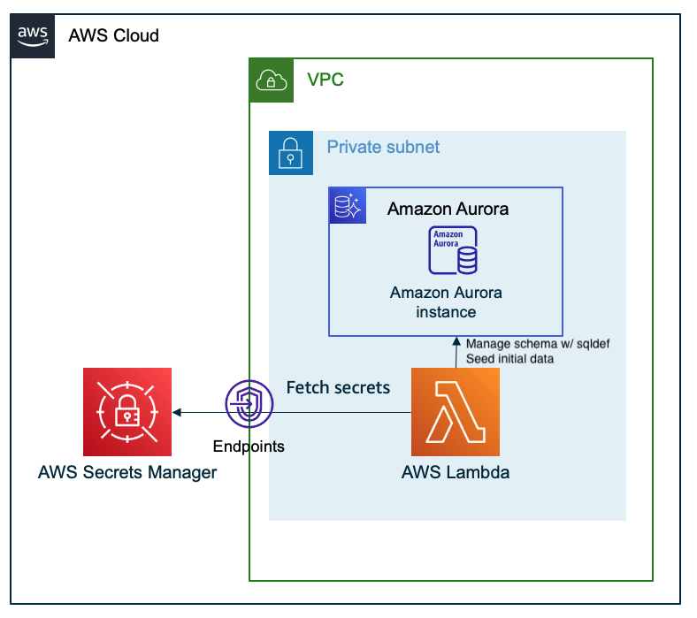

# Serverless Database Schema Management for RDBMS
[](https://github.com/aws-samples/aws-lambda-with-rdb/actions/workflows/build.yml)

## Overview
This sample shows you how to manage schema of RDBMS such as Amazon RDS, leveraging AWS Lambda and [sqldef](https://github.com/k0kubun/sqldef), an idempotent and declarative SQL schema management tool.
You can also seed initial data to your database tables, allowing you to fit this sample in various use cases.

Just for example this sample deploys an Amazon RDS Aurora MySQL/Postgres cluster, but you can use the mechanism with any MySQL/Postgres clusters as long as Lambda can connect to them.

## Architecture

There is only one CDK stack. The architecture is shown below.



## Directory Structures

```sh
.
├── bin
│   ├── db-definer.ts              # Define CDK Stack
│   └── db-settings.ts             # Define type of database family (PostgreSQL, MySQL) settings
├── lambda
│   └── db-definer
│       ├── schema                 # Table Definition. SQL file in this folder will be executed
│       └── seed
│           ├── mysql              # Seed SQL file for MySQL
│           └── postgresql         # Seed SQL file for PostgreSQL
└── lib
    ├── database.ts                # Amazon Aurora and AWS Lambda are defined here
    └── db-definer-stack.ts        # VPC and database

```

## Main Libraries

- aws-cdk
- typescript
- sqldef
  - For more information, please see below.
  - [k0kubun/sqldef: Idempotent schema management for MySQL, PostgreSQL, and more](https://github.com/k0kubun/sqldef)

## Prerequisites

- npm
- aws cli v2
- cdk
- docker
- configuration of aws profile

## Getting Started

### 1. Clone the repository

- Run `git clone` command to download the source code.

### 2. Deploy resources

- Run `npm ci` command in the top of this directory.
- Run `npx cdk deploy` to deploy these resouces.
- When resouces are successfully deployed, outputs such as `DbDefinerStack.DBDBLambdaName` will be shown in the terminal. These values will be used to define tables.
- You can edit DDL in `./lambda/db-definer/schema` and DML in `./lambda/db-definer/seed` before deploy.

```sh
Outputs:
DbDefinerStack.DBDBLambdaNameXXXXXXX = DbDefinerStack-DBDbDefinerXXXXXX
Stack ARN:
arn:aws:cloudformation:xyz-region-x:XXXXXXXXXXX:stack/DbDefinerStack/XXXXXXXXXXXXXXXXXX
```

### 3. Define Table

`DbDefinerStack.DBDBLambdaName` accept these command from event.

1. `init`  
    Drop and create database. You can use this command under developing.
    SQL file in `./lambda/db-definer/schema` will be reflected.
2. `preview`  
    Preview change the definition of table from SQL file in `./lambda/db-definer/schema` by using sqldef.
3. `sync`  
    Synchronize table in database to SQL file in `./lambda/db-definer/schema` by using sqldef.  
    You can preview SQL that will be excuted by sqldef.
4. `seed`  
    Run SQL file in `./lambda/db-definer/seed/mysql` or `./lambda/db-definer/seed/postgresql`.  
    You can use this command for inserting seed data to database.

For example, when you want to initialize DB, run below command in the terminal.  
You can excute this lambda from AWS Management Console.

```sh
aws lambda invoke --function-name [DbDefinerStack.DBDBLambdaName] --payload '{"command":"init"}' --cli-binary-format raw-in-base64-out res.txt
```

## Security

See [CONTRIBUTING](CONTRIBUTING.md#security-issue-notifications) for more information.

## License

This library is licensed under the MIT-0 License. See the LICENSE file.
